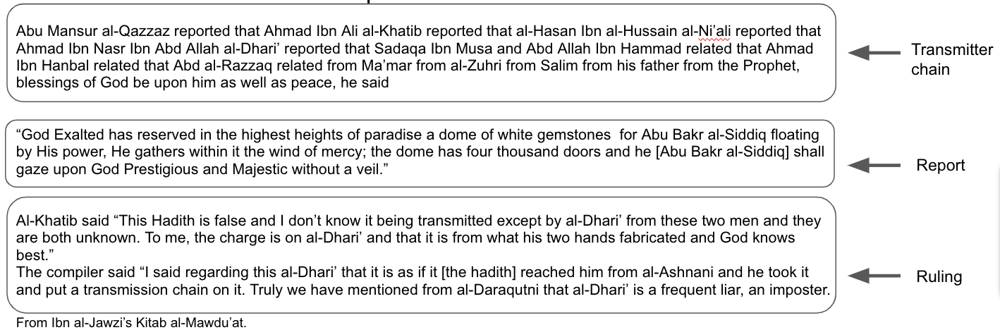
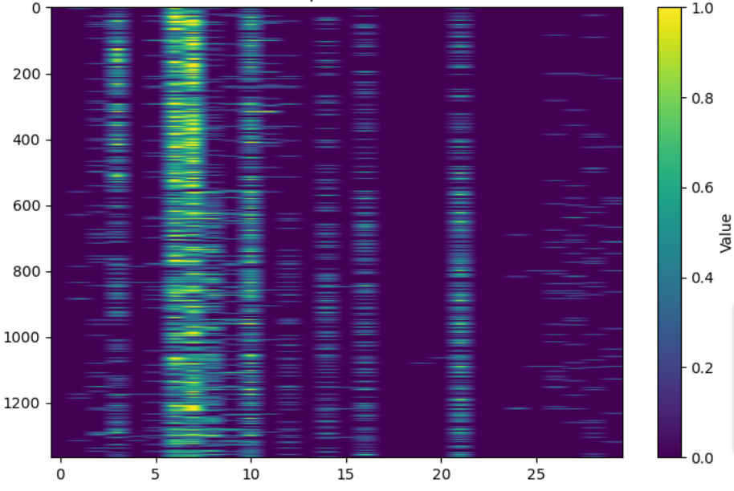
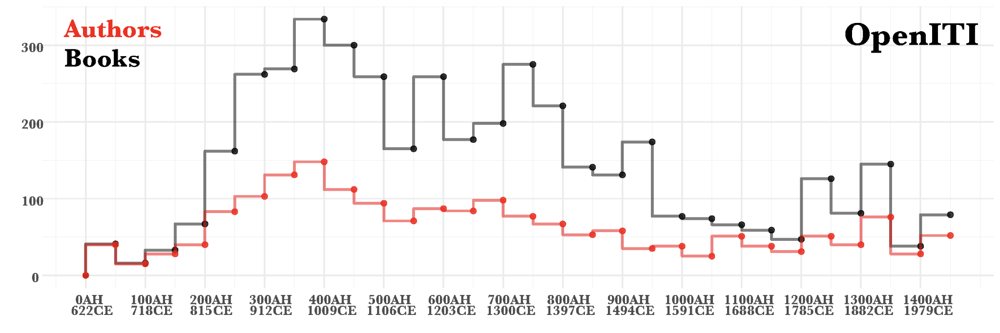

# What is MatnTracker and why?

## Table of Contents
- [Short Description](#short-description)
- [Historical Background: What is a hadith?](#historical-background-what-is-a-hadith)
- [The Project: Measuring textual authenticity](#the-project-measuring-textual-authenticity)
- [Methodology and Code Description](#methodology-and-code-description)
- [Installation](#installation)
- [Usage](#usage)
- [Data](#data)
- [Feedback](#feedback)
- [Acknowledgments](#acknowledgments)
- [References](#references)

## Short Description
MatnTracker is a Jupyter Notebook created by Irene K.F. Kirchner as part of a broader academic project aimed at mapping the transmission and circulation history of hadith forgeries within Islamic literature. This tool tracks prophetic reports (hadith) within a corpus of historical works, enabling users to visualize where these reports reappear.

## Historical Background: What is a hadith?
In the Islamic tradition, a hadith is a report that records the actions, sayings, or approvals of the Prophet Muhammad serving as a guide for Muslims in matters of faith, ethics, jurisprudence, and daily conduct. As the Quran only provides limited textual source material, the corpus of prophetic reports gradually gained tremendous significance as the (quantatively) main scriptural source in the Sunni tradition. With the death of the last companions of the Prophet, forgeries surged as they presented a unique opportunity to salvage the authoritative and spiritual power of the Prophet to forward political, legal, and social interests. Consequentially, it became established practice to insist on the transmission not only of the report itself but also of its chain of transmitters. This practice enabled a complex scholarly engagement with prophetic reports that motivated one of the most prolific textual productions in history. Over centuries, Sunni scholars produced a vast body of hadith literature that documented biographical data on the transmitters of each prophetic report, the details of transmission, the historical context of the transmission and the transmitters as well as collections of authenticated reports and collections of forgeries.

A hadith is structured into two essential components:
1. The chain of transmitters (Isnād): This section includes the names of all the transmitters involved in transmitting the report, tracing it back to the Prophet Muhammad.
2. The actual report (Matn): This is the actual narrative of the actions or statements of the Prophet Muhammad.
In the genres of hadith literature, a hadith is frequently commented on by the scholars in a third part:
1. The Ruling (Ḥukm): Here, scholars assess the soundness of the transmitter chain, identify weak or missing links, provide their judgment regarding the overall authenticity of the hadith, and reference other scholars' opinions and rulings.



## The Project: Measuring textual authenticity
This GitHub repository is a part of my dissertation project and focuses on a specialized area of hadith scholarship—hadith forgeries. Specifically, it examines the most comprehensive and arguably most famous forgery collection in Islamic history, the Kitāb al-Mawḍūʿāt by the 12th-century scholar Ibn al-Jawzī. Its central objective is to track the evolution of forgery collections (Mawḍūʿāt) as a genre of hadith literature and map the transmission and circulation history of individual forgeries.

The notebook measures the textual overlap between Ibn al-Jawzī's collection and other Mawḍūʿāt collections compiled from the late 11th century to the end of the 19th century. Additionally, it tracks the extent of overlap between Ibn al-Jawzī's work and earlier works in related genres of ḥadīth literature, such as transmitter criticism (kutub al-ḍuʿafāʾ) and collections of defective ḥadīth (ʿilal al-ḥadīth). By tracing and quantifying these overlaps, the project endeavors to map the historical transmission and circulation of hadith forgeries and explore the evolving construction of the Mawḍūʿāt genre, from the 11th century onwards.

## Methodology and Code Description
The primary objective of this research is to systematically trace the transmission of each forged report from Ibn al-Jawzī's Kitāb al-Mawḍūʿāt within selected works of hadith literature spanning from the 9th to the 19th century. Text Reuse and Alignment algorithms, which detect overlap of variable length and similar but not identical overlap between source and target texts, are unsuitable for this study. These algorithms often yield a high proportion of false positives due to the redundancy inherent in transmission chains and the brevity of many reports, where more than 20% consist of five tokens or fewer. Given that hadith are typically circulated verbatim (bi'l-lafẓ), similar instances may not represent actual reuse instances, and a search algorithm that demands exact correspondence proves more effective.

This code employs ripgrep, a line-oriented search tool that recursively searches the current directory for a regex pattern. It searches the corpus of text files for the established keygrams and checks the matches for the established keywords in order to filter out false positives. As part of the New Languages for NLP project at Princeton (2021-2022), we (see below in Acknowledgements) manually annotated the Ibn al-Jawzī's Kitāb al-Mawḍūʿāt to differentiate the three sections of a hadith: Isnād, Matn, Ḥukm. In preparation for this notebook, I extracted the Matns (Arabic plural: Mutūn), cleaned them with ReadITI, manually removed redundant versions of a report, and created a CSV file with the Matns and a unique ID for each Matn.

The Matn sections of the hadith reports were manually extracted and cleaned using ReadITI. Redundant versions of a report were systematically removed, resulting in a CSV file with unique Matns, each assigned a unique ID. Works of hadith literature were manually selected, sourced from the OpenITI repository, and similarly cleaned with ReadITI, yielding .sentence output files with one sentence per line. The developed code establishes a "keygram" for each report, defined as a 4-gram with the highest TF-IDF value, reflecting frequent occurrence in the report while rare occurence in the entire document. Additionally, the code identifies the keyword with the second-lowest document frequency for each report. The code then uses ripgrep, searches the corpus of text files for the established keygrams, and filters out matches that do not contain the established keywords in order to further mitigate false positives. Subsequently, it constructs a dataframe illustrating the location of each Matn within the text files.

The code generates four output files:
1. a CSV file containing the Matn IDs, Matns, all 4-grams, their frequencies, keygrams, and keywords for quality assurance;
2. a CSV file featuring Matn IDs, Matns, keygrams, and keywords for enhanced overview;
3. a CSV file encompassing Matn IDs, Searched String, Full Text, Line Found, and File Path, listing all matches with Line Found serving for manually filtering out false positives; and
4. a CSV file organizing the output into a matrix format, where rows represent Matn IDs, columns denote text file names (books), and each cell signifies the count of matches.
Furthermore, the code generates a heatmap image of this matrix, to provide an easy visual overview of the collected data.



The heatmap can be saved via a right-click on the image.

## Installation
To use the MatnTracker, you'll need to set up a Jupyter Notebook environment and install the necessary Python libraries. 
- `pandas`
- `nltk`
- `scikit-learn`
- `numpy`
- `matplotlib`
- `seaborn`
Once you have these libraries installed, clone this repository to your local machine. You can do this using Git or by downloading the repository as a ZIP file and extracting it.
Then, start a Jupyter Notebook server by running the following command in your terminal within the repository folder:
   ```bash
   jupyter notebook MatnTracker.ipynb

## Usage
To effectively employ the MatnTracker tool, follow these steps:

1. Download the notebook (see installation guide).
2. Prepare Input Files:
   - Ensure you have the following files ready:
     - CSV1: This file should contain two columns. The first column should consist of unique Matn IDs, while the second column should contain the corresponding Matn sections, which contain the reports to be tracked.
     - CSV2: In this file, place all Matn IDs in the first row, and set text file names as column headers. This file will be used for reference.
     - Folder: the target corpus of cleaned plain text files in one folder
3. Load Input Files: Load your CSV1 file at the specified input_csv_path.
   ```bash
   # Load your CSV file
   input_csv_path = 'CSV1/Input/Path/filename.csv'
4. Set the Corpus Directory: Configure the directory path to your collection of clean text files that serve as your target texts for this search.
   ```bash
   txt_files_directory = 'Path/To/Your/Target/Texts/Folder'

   df = pd.read_csv(result2_csv_path, encoding='utf-8')
5. DataFrame Initialization: Initialize a DataFrame with headers from CSV2 and populate it based on the provided dictionary of headers.
   ```bash
   # Initialize a dataframe with headers from CSV2 file and fill it based on the dictionary
   headers = pd.read_csv('Dataframe/Path/with/MatnIDs/And/TextFileNames').columns[1:]
   sorted_output_df = pd.DataFrame(columns=headers)
6. Configure Output Paths: Customize the output file paths according to your preferences:
   - Adjust the paths for
   1. result_df.to_csv, result
      ```bash
      # Create outputFile1 with Matn_ID, Matn, 4-grams, 4-grams_Frequencies, Keygram, Keyword for checking
      # Change file path to your desired path
      result_df.to_csv('Output1/File/Path/filename.csv', index=False)
   2. result2_csv_path
      ```bash
      # Create OutputFile2 with only Matn_ID, Matn, Keygram, and Keyword columns
      selected_columns = ['Matn_ID', 'Matn', 'Keygram', 'Keyword']
      result2_df = result_df[selected_columns]
      # Change file path to your desired path
      result2_csv_path = 'Output2/File/Path/filename.csv'
      result2_df.to_csv(result2_csv_path, index=False, encoding='utf-8')
   3. output_csv_path
      ```bash
      output_df = pd.DataFrame(results, columns=['Matn_ID', 'SearchedString', 'FullText', 'LineFound', 'FilePath'])
      output_csv_path = 'Output3/File/Path/filename.csv'
      output_df.to_csv(output_csv_path, index=False, encoding='utf-8')
   4. sorted_output_csv_path
      ```bash
      # Save the resulting dataframe to an output CSV file
      sorted_output_csv_path = 'Output4/File/Path/filename.csv'
      sorted_output_df.to_csv(sorted_output_csv_path, index=False, encoding='utf-8')     
     to specify your desired locations for output files.
7. Run the notebook cell by cell.

## Data
The text files that represent the target texts for this study were downloaded from the OpenITI, a corpus of digital Islamicate texts. The latest release of OpenITI contains 10,202 text files, each of which contains the full text of a work (whether it is a single-volume or multi-volume work). For some works, the corpus contains multiple versions (digitizations of distinct paper editions, distinct digitizations of the same edition, identical digitizations of the same edition). The 10,202 text files represent 6,236 distinct works, by 2,582 distinct authors.




## Feedback
Wanna talk about my code? Open an issue and let me know!

## Acknowledgments
The annotation work preceding this study was done in cooperation with my colleague Maroussia Bednarkiewicz and supported by Tulaib Zafir and Nuh Elalaoui as part of the New Languages for NLP project at Princeton University between June 2021 and May 2022. It was organized and guided by the expert advice of Andrew Janco, Natalia Ermolaev, Toma Tasovac, David Lassner, Quinn Dombrowski, et al.
The OpenITI team, specifically Sarah Bowen Savant and Ryan Muthers, have also generously provided their feedback for this study.
The ReadITI notebook used in the preprocessing of the input files was programmed by my much-valued colleague and friend, Maroussia Bednarkiewicz.

## References
- [RipGrep](https://github.com/BurntSushi/ripgrep): The RipGrep original code is on GitHub.
- [Ripgrepy](https://github.com/securisec/ripgrepy): The implementation of RipGrep for Python can also be found on GitHub.
- [Ripgrepy Documentation](https://ripgrepy.readthedocs.io/en/latest/): Its documentation is available on ReadTheDocs.
- [OpenITI](https://zenodo.org/record/6808108): Nigst, Lorenz, Romanov, Maxim, Savant, Sarah Bowen, Seydi, Masoumeh, & Verkinderen, Peter. (2022). OpenITI: a Machine-Readable Corpus of Islamicate Texts (2022.1.6) [Data set]. Zenodo.
- [OpenITI](https://github.com/OpenITI): The OpenITI corpus is also on GitHub.
- [ReadITI](https://github.com/Maroussia/readiti): The ReadITI original code is on GitHub. 
